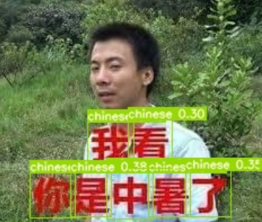
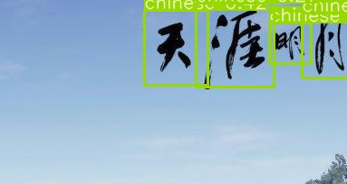
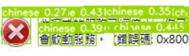
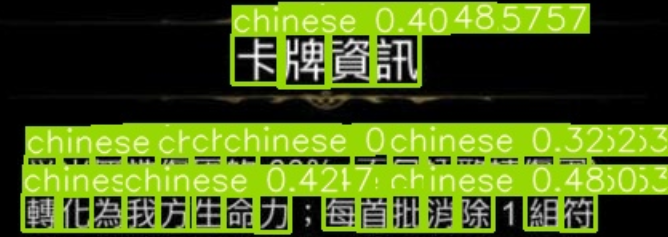
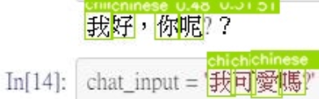
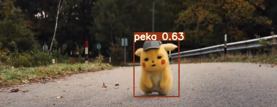
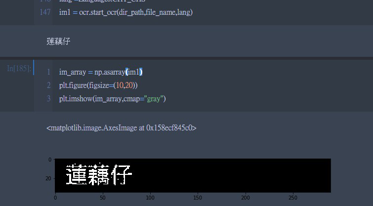

# yolov3 #

# Requirements

yolov3:

- `pytorch >= 1.0.0`

- `opencv-python`

ocr:

- `pytesseract`
- `matplotlib`
- `Pillow`


## weight ##

darknet53 pretrained weight:

```
wget https://pjreddie.com/media/files/darknet53.conv.74
```

other pretrained weight:

<https://pjreddie.com/darknet/yolo/>

## show ##

yolov3 效果展示:














OCR 效果展示:

